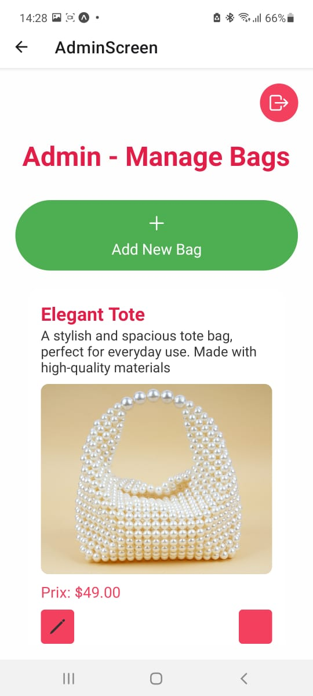
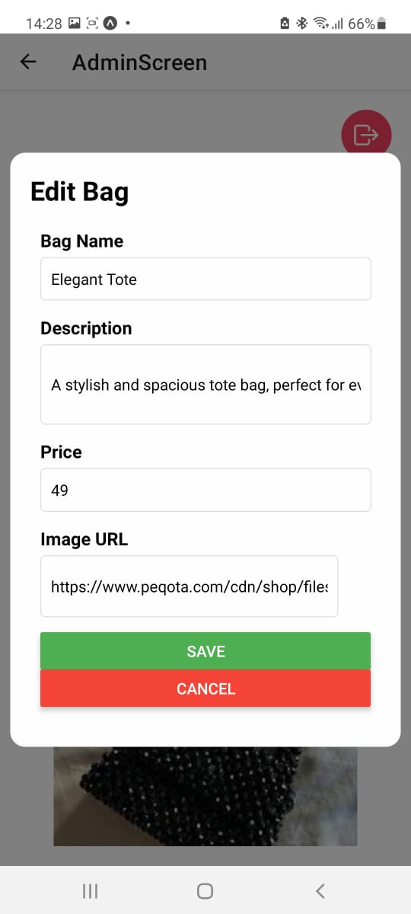

# CarryLux ✨

**CarryLux** est une application moderne et élégante qui propose une expérience fluide pour l'achat de sacs haut de gamme. Elle offre également aux administrateurs des outils efficaces pour gérer facilement les produits. Avec CarryLux, trouvez le sac parfait ou prenez le contrôle total de votre inventaire !

---

## 🚀 Fonctionnalités Principales

### 🎯 Pour les Utilisateurs
- 👜 **Explorer des collections** : Découvrez une large sélection de sacs avec des descriptions détaillées et des images.
- ❤️ **Favoris personnalisés** : Ajoutez vos sacs préférés à une liste pour les revoir plus tard.
- 🛒 **Achetez facilement** : Ajoutez au panier et procédez au paiement en toute simplicité.

### ⚙️ Pour les Administrateurs
- 📦 **Créer des produits** : Ajoutez des sacs en renseignant leurs détails et images.
- ✏️ **Modifier les produits** : Ajustez les prix, descriptions ou disponibilités des sacs.
- 🗑️ **Supprimer les produits** : Supprimez les articles obsolètes ou en rupture de stock.
- 🧰 **Gestion complète** : Une vue centralisée pour tout l'inventaire.

### 🔒 Authentification
- 🎭 **Rôles multiples** : Expérience dédiée pour les utilisateurs et les administrateurs.
- 🔐 **Sécurité avancée** : Gestion sécurisée des connexions avec des rôles distincts.

---

## 📸 Captures d'Écran

### Page d’accueil  🛍️


### Page d’accueil - Utilisateur 🛍️


### Gestion des Produits - Administrateur 🛠️


### Edit d’un Sac 👜


### Add 👜


### Login Page 


### Register


---

## 🛠️ Technologies Utilisées

- **Frontend :** React Native & Expo
- **Backend :** Node.js (Express)
- **Base de données :** MongoDB
- **Communication API :** Axios
- **Icônes :** Ionicons

---

## 🌟 Installation et Démarrage

### Prérequis
1. Node.js installé (v14+ recommandé).
2. Expo CLI installé globalement :
   ```bash
   npm install -g expo-cli
